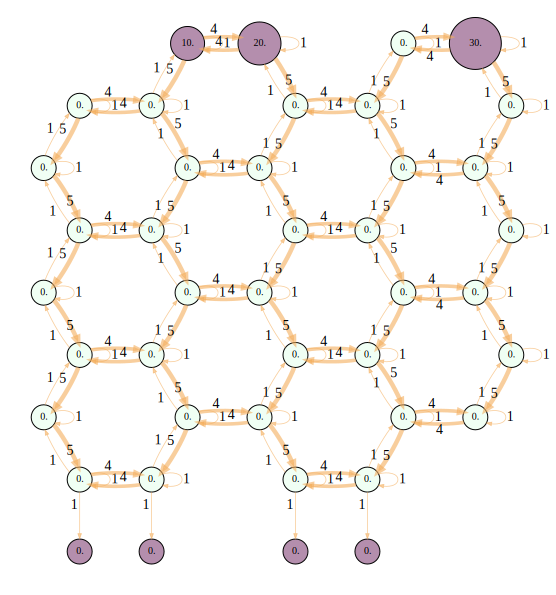
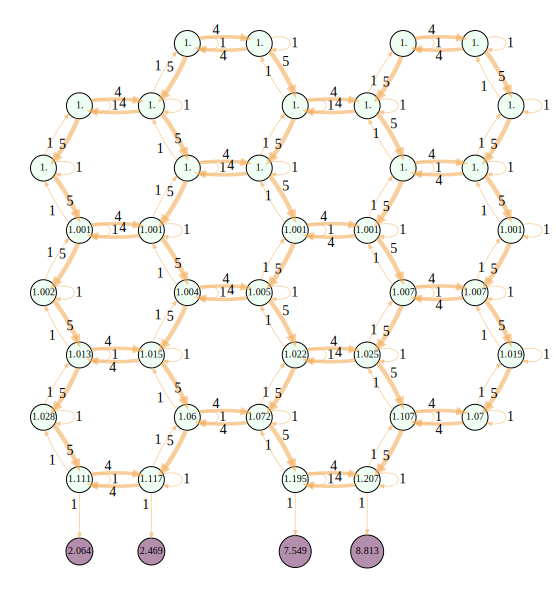

This is a project devoted to the extension of the [resource network model](https://www.ipu.ru/sites/default/files/card_file/DisserZhilyakova.pdf). Example of a sponge network and its dynamics is presented below.

