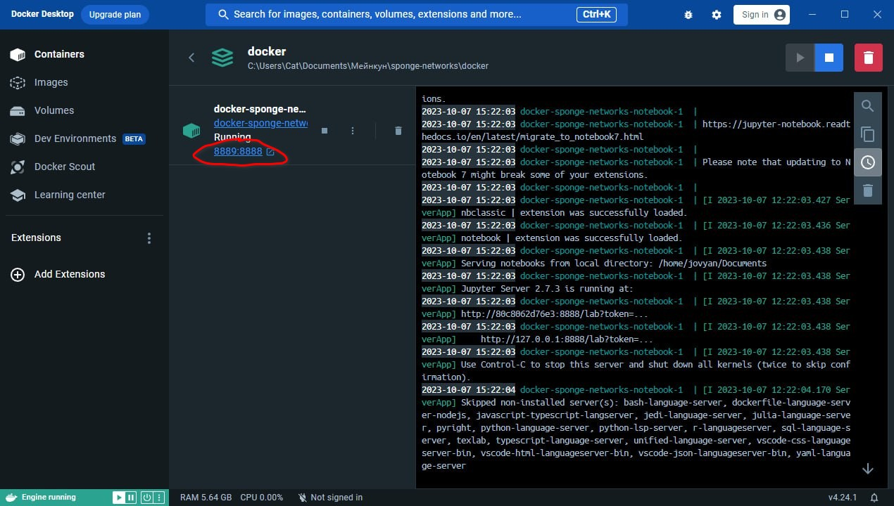
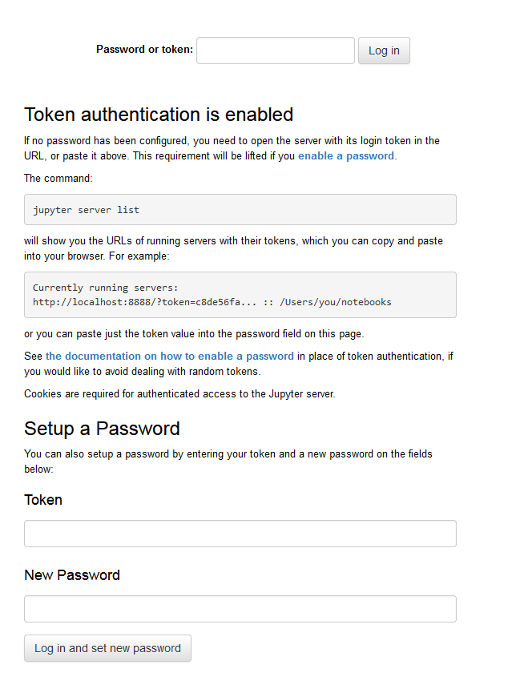

# Инструкция по установке докер-образа программы

Для всех дальнейших действий требуется ОС `Windows 10` или больше, на `Windows 7` не сработает.

1. ### Установить `chocolatey`:
   1. В любом месте в виндоусе нажать `win+R`. Откроется (в левом нижнем углу) маленькое окошко, куда можно писать текст. Написать там "`powershell`" и нажать `ctrl+shift+enter` -- откроется консоль powershell от имени администратора (попросит подтвердить, что вы действительно хотите открыть от имени администратора).
   2. В консоли написть 
      ```powershell
      Set-ExecutionPolicy Bypass -Scope Process -Force; [System.Net.ServicePointManager]::SecurityProtocol = [System.Net.ServicePointManager]::SecurityProtocol -bor 3072; iex ((New-Object System.Net.WebClient).DownloadString('https://community.chocolatey.org/install.ps1'))
      ```
   3. Установится менеджер пакетов chocolatey. После установки для дальнейшего использования `chocolatey` требуется закрыть консоль и открыть заново (см. п.1.1).
2. ### Установить подсистему Windows для Linux
   1. В консоли powershell (п.1.1) написать
      ```powershell
      wsl --update
      ```
      Будет произведена установка подсистемы для linux, что необходимо для работы docker.
3. ### Установить докер
   1. В консоли (п.1.1) написать
      ```powershell
      choco install -y docker-desktop
      ```
   2. Если все прошло гладко, то через некоторое (возможно, весьма долгое) время в систему будет установлено приложение `Docker Desktop`. Соответствующая иконка, скорее всего, появится на рабочем столе.
   3. Для завершения установки необходимо перезагрузить компьютер.
   4. После перезагрузки вылезет окошко `Docker Subscription Service Agreement`, принимаем условия.
   5. По идее, после того, как прогрузится интерфейс, окошко можно закрывать -- оно нам понадобится чуть позже.
4. ### Установить образ `sponge-networks-notebook`
   1. Необходимо иметь установленный git и git bash. Это, кстати, тоже можно сделать (если еще нет) легко и удобно через chocolatey: `choco install -y git`.
   2. В какой нибудь папке с документами открыть git bash и написать `git clone https://github.com/heinwol/sponge-networks`. Это скопирует папку с проектом sponge networks из github в то место, где вы находитесь: появится подпапка `sponge-networks`.
   3. Для того чтобы в git bash переместиться в необходимую папку напишите `cd sponge-networks/docker`. Это подпапка с проектом докера.
   4. Теперь следует написать `docker compose create`. Это долгий процесс, в его ходе целиком соберется и установится контейнер с проектом sponge-networks и юпитер-ноутбуком -- абсолютно отдельно от всей остальной системы.
   5. После успешного завершения окошко с git bash можно закрыть.
5. ### Использование
   1. В приложении `Docker Desktop` теперь в графе "containers" теперь появится один-единственный нужный контейнер. Его следует выбрать.
   2. Появится следующее окошко:
      
      Следует нажать на обведенную кнопку. 
   3. В браузере откроется специальное окошко:
      
      В верхнее поле ввести `0000` и нажать `Log in`. Браузер, возможно, предложит сохранить пароль. Я бы рекомендовал это сделать, если не хочется каждый раз вводить пароль руками.
   4. Ура, мы в юпитере! Папка, в которой мы начинаем -- пользовательские документы.
   5. Для остановки контейнера в приложении `Docker Desktop` нажать кнопку "стоп" (там же где и "старт").
   6. После завершения работы с юпитером рекомендую также останавливать всю подсистему докера (кнопка с иконкой выключения в левом нижнем углу)
      - Может случится, что даже после выхода из докера подсистема linux окажется все еще работающей, что забирает много ресурсов компьютера (несколько гигабайт оперативной памяти, например). Для остановки подсистемы линукса в консоли powershell можно написать `wsl --shutdown`.
      - В любом случае, после перезагрузки компьютера ни подсистема linux, ни докер включаться сами по себе и тратить ресурсы компьютера не будут
   